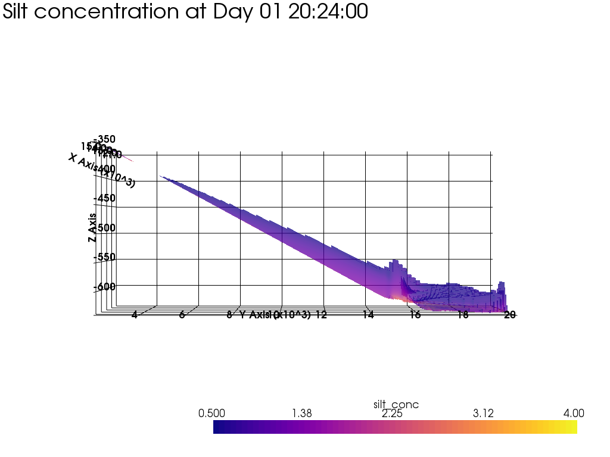

Approach is like this ([Kind of like this example](https://docs.pyvista.org/examples/00-load/terrain-mesh.html#sphx-glr-examples-00-load-terrain-mesh-py))

1. The X and Y meshgrids in the NetCDF file are repeated 'Nr of sigma interfaces/layers' times (`trim.SIG_INTF.size`)

```python
   x_interfaces = np.repeat(trim.XCOR.values[:,:, np.newaxis], trim.SIG_INTF.size, axis=2)
   y_interfaces = np.repeat(trim.YCOR.values[:,:, np.newaxis], trim.SIG_INTF.size, axis=2)
```

   Now all three have equal dimensions, in this case (62, 202, 81)

2. Next, we ravel these arrays, now we have three matrices of size 62 * 202 * 81= 1 014 444

3. Applying column_stack on these we get an array with x,y,z coordinates, (1014444, 3), which is an 'ordered' list containing all point coordinates.

```python
	xyz_interfaces = np.column_stack((x_interface_ravel, y_interface_ravel, depth_ravel))
	xyz_interfaces.shape
```

4. Define a StructuredGrid and add these as its points

```python
depth_interfaces_grid = pv.StructuredGrid()
depth_interfaces_grid.points = xyz_interfaces
```

5. Then set the dimensions of the StructuredGrid so PyVista/VTK can 'reconstruct' the quad cells of the mesh. 

 ```python
 depth_interfaces_grid.dimensions = [81, 202, 62] 
 ```

​	According to this issue in the PyVista repository ([Visualise a 2D image from array of x, y, z and data points](https://github.com/pyvista/pyvista-support/issues/28#issuecomment-514016207)) this works because the nodes are already in the right order. As it says in [the docs](https://docs.pyvista.org/core/index.html#core-api)

> - A [`pyvista.StructuredGrid`](https://docs.pyvista.org/core/point-grids.html#pyvista.StructuredGrid) is a regular lattice of points aligned with an internal coordinate axes such that the connectivity can be **defined by a grid ordering**. These are commonly made from `np.meshgrid()`. The cell types of structured grids must be 2D Quads or 3D Hexahedrons. 

And now we have a StructuredGrid true to the sigma-layer grid (ie depth) with (in this case) 980880 cells and 1 014 444 points!

## Example of 3D thresholded Suspended Silt Concentration 



Not bad eh, there are more figures in the output_material folder in the repository.