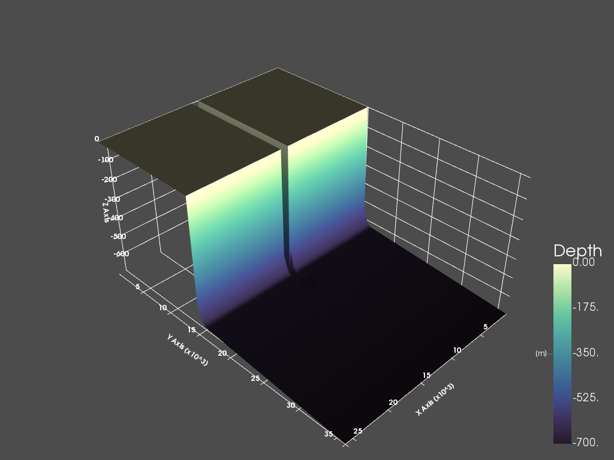

# Delft3D-FLOW Python Tools for humans
### Declarative Delft3D-FLOW file generation and visualisation

## See the organized scripts and clean notebooks [here: pyDelft3D-FLOW](https://github.com/JulesBlm/pyDelft3D-FLOW)

Some sane tools for my thesis too ease the pain of having to work with Deltares' [Delft3D-FLOW](https://oss.deltares.nl/documents/183920/185723/Delft3D-FLOW_User_Manual.pdf)'s insane file formats and to automate the tedious manual labor involved in setting up multiple succesive simulations. Also processes NetCDF for plotting with Holoviews and PyVista.

## JulesD3D

The folder JulesD3D contains some scripts to

* Write or read grid (`.grd`), depth ( `.dep`), enclosure (`.enc`)
* Read and write discharge boundary condition (`.bcc`, `.bct`) records declaratively.
* Declaratively generate a  DELFT3D-FLOW4 bathymetry model (depth, grid, enclosure) with a smoothened slope break (DepthModel.py)
* [Prepare subsequent models for restarting from previous simulation](Multirun.md) (multipleruns.py)
* Process netCDF files for plotting with xarray, HoloView/hvPlot and PyVista
* [See this on how to visualize Delft3D-Flow netCDF with PyVista](Delft3D_to_PyVista_Approach.md) 

## Notebooks

Furthermore there are some notebooks to

* Visualize [Delft3D-FLOW netCDF output](Delft3D_NetCDF_Output_overview.md)

  * [hvPlot](https://hvplot.pyviz.org/) for interactive plots
  * [Holoviews](http://holoviews.org/) to write cross-section animations to .mp4 files
  * [PyVista](https://www.pyvista.org) for 3D plotting both hydrodynamic and underlayer properties
  * ~~Matplotlib plus some widgets to quickly make some plots~~ [abandoned]
* Manually change values in a netCDF outputfile and write it to disk\
  * Reset hydrodynamic properties
  * Reset transport layer

##  Demo images

See the folder 'output_material' for more images and videos.

### Disclaimer

This is very much a work in progress so it's all still very messy and hacky:  ¯\_(ツ)_/¯.  I use this to visualise the results of modelling turbidity currents and their deposits in Delft3D. If you're looking for tools to visualize Delft3D ocean or river modelling I'd suggest to look at one of these libraries.

* [Geoviews](http://geoviews.org/)
* [xrviz](https://xrviz.readthedocs.io/en/latest/)
* [Gridded](https://github.com/NOAA-ORR-ERD/gridded)
* [Thyme](https://github.com/noaa-ocs-modeling/thyme) 
* [xgcm](https://github.com/xgcm/xgcm)
* [Iris](https://scitools.org.uk/iris/docs/latest/)
* [gridgeo](https://pyoceans.github.io/gridgeo/gridgeo_tour.html)

## Potential To Do list

1. Use pandas for file reading and writing D3D files	
  1. Has nice display views too
2. Finish Overarching d3d class
3. [HTML repr strings](https://ipython.readthedocs.io/en/stable/config/integrating.html)
4. Option to use h5py instead of netCDF4
5. Better plotting of underlayers
  1. Subtract from depth?
  2. Add time dependent, multi-dimensional coords following DP_BEDLYR for interactive plotting with hvPlot
6. Filter early with xarray.where() for 3d PyVista (timeslider) plots, instead of opacity hack or thresholding with pyvista
7. Clean poetry.lock and pyproject.toml of unused deps
8. Make use of Unit-based arrays with Pint and xarray
9. Better documentation
10. Convert functionality in `GenerateBCRecords.ipynb` to a seperate .py file
11. Script for reading and writing Morphology files (especially underlayers)
12. Rename sediments (constituents) dimensions in dataset for labeled selection.
13. Notebook showing overview of MDF file
14. Use Panel for better & cleaner widgets, both for hvPlot and for PyVista
15. Properly structure JulesD3D folder as package
16. Use ufuncs to increase performance in process 
   1. Add depth
   2. Vector sums (velocity, bottom stress, sediments etc)
17. Move notebooks to separate folders
18. Check location of values on staggered grid (face vs edge etc) maybe use parts of [Gridded](https://github.com/NOAA-ORR-ERD/gridded) for this
19. Improve code quality and clean notebooks. Less hardcoded variables, more functions
   * Read up on Python OOP/classes
20. Find a way to add coordinates to the whole dataset, for vertical cross-sections.

## Credits

- Deltares [OpenEarthTools](https://svn.oss.deltares.nl/repos/openearthtools/trunk/python/) (abandoned)
- spmls' [Pydelft](https://github.com/spmls/pydelft) 
- NOAA's [Gridded](https://github.com/NOAA-ORR-ERD/gridded)
- [PyVista](https://www.pyvista.org)
